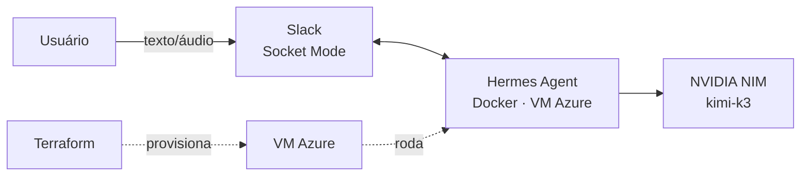

<h1 align="center">
  hermes-agent
</h1>

<p align="center">
  
</p>

<p align="center">
  
</p>



Agente pessoal self-hosted ([Hermes Agent](https://github.com/NousResearch/hermes-agent), Nous Research) rodando numa VM Azure, acessível via Slack. Contexto completo das decisões em [`docs/plan.md`](docs/plan.md).

## Stack

- **Infra**: Terraform (`terraform/azure`), state remoto no HCP Terraform.
- **Runtime**: Docker Compose por serviço (`compose/<serviço>/`), orquestrado por `compose/docker-compose.yml` via `include`.
- **LLM**: NVIDIA NIM (`moonshotai/kimi-k3`), free tier.
- **Canal**: Slack, Socket Mode.

## Estrutura

```
terraform/azure/      # VM, rede, firewall
terraform/scripts/    # cloud-init (Docker)
compose/<serviço>/    # docker-compose.yml + config declarativo por serviço
docs/                 # plano do projeto e specs de design
```

